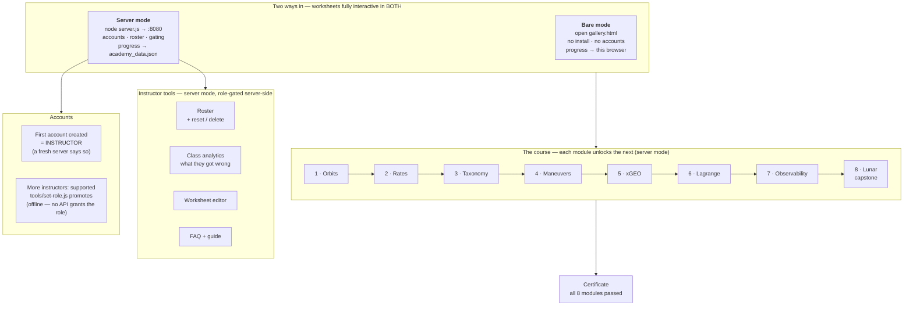

# 🛰 ORBIT ACADEMY — v5.2

An interactive course that teaches orbital dynamics to non-specialists — from "what is an orbit?"
through cislunar space — using a live 3-D simulator, guided worksheets, quizzes, and a real
course-management backend (accounts, prerequisite gating, progress tracking, instructor roster).

Built for JASON / US Space Force technical-staff training. Companion to the CISLUNAR PATROL game
and the xGEO simulator.

**Runs fully offline, straight out of the box.** The course makes **zero outbound network calls** —
no CDNs, no fonts, no telemetry — so it installs and runs on standalone / air-gapped machines.

**Every byte it needs is committed to this repository**, including the 3-D library and the planet
maps. There is no download step, no `npm install`, and no build: clone or copy the folder onto an
air-gapped machine and it runs. That also means there is no version drift — every classroom runs
identical bytes, today and in five years. Provenance, licenses and SHA-384s for every third-party file
are recorded in [`public/vendor/NOTICE.md`](public/vendor/NOTICE.md).

Verify a tree any time — no network needed:

```bash
bash tools/fetch-vendor.sh --check     # every vendored asset matches its recorded hash
node test/no-external-calls.test.js    # nothing in the course can call out
```

## Download

Two editions, built from the same source by `bash tools/make-bundle.sh`. Pick one file, unzip it,
open **`START-HERE.html`**. That is the whole installation — nothing is fetched, built or installed.

| | **Standalone** (`orbit-academy-vX.Y-standalone.zip`) | **Full** (`orbit-academy-vX.Y.zip`) |
|---|---|---|
| Size | ~9.6 MB | ~11 MB |
| For | one person learning; a reviewer; a laptop in a vault | an instructor running a cohort |
| To install | nothing at all | Node.js, only for the tracked mode |
| All 8 modules, worksheets, simulators | ✅ | ✅ |
| Interactive quizzes + saved progress | ✅ *(this browser)* | ✅ *(per account, any browser)* |
| Accounts, prerequisite gating | — | ✅ |
| Instructor roster + class analytics | — | ✅ |
| Worksheet editor | — | ✅ |

The standalone edition deliberately ships **no server and no sign-in page**, so there is nothing in it
to misconfigure. Start with it; moving up later means downloading the full edition over the top.

```bash
bash tools/make-bundle.sh              # full edition
bash tools/make-bundle.sh --vanilla    # standalone edition
bash tools/make-bundle.sh --full       # full + tests and build tools (developers)
```

The build refuses to ship if `academy_data.json` leaks in, a required asset is missing, or any CDN
reference survives, and prints a SHA-256 to publish alongside the file.

> **Why a zip and not a `.pkg`/`.msi`?** The course has exactly one dependency — Node.js — and only
> for the tracked mode. A native installer would exist to install one thing we cannot redistribute,
> while an *unsigned* `.pkg`/`.msi` produces a scarier warning than a zip, signing needs a paid Apple
> Developer ID or Windows code-signing certificate, and in an accredited or air-gapped facility
> installers frequently cannot run at all (admin rights, application allowlisting) whereas an unpacked
> folder passes review easily.

## How it fits together



Every module is a **worksheet** (data-driven content) plus a **simulator**. Finishing all a module's
tasks passes it and unlocks the next; gating is enforced by the server, not the page.

## Requirements

Deliberately minimal. **No `npm install`, no build step, no database, and no internet at run time.**

### To run the course (what students and instructors need)

| Need | Version / notes | Required for |
|---|---|---|
| **A modern browser with WebGL** | Chrome, Edge, Firefox or Safari, last ~3 years. Hardware acceleration on. | Everything. The simulators are 3-D. |
| **three.js r128** | ~600 KB, **already committed** in `public/vendor/`. Nothing to fetch. | The 8 simulators. |
| **Node.js** — LTS (18+; tested on 22) | One ~50 MB install from <https://nodejs.org>. Uses **only Node built-ins** — nothing to install with it, ever. | *Only* the tracked mode: accounts, saved progress, prerequisite gating, instructor roster. |

Node is **optional**. Without it, open **`public/gallery.html`** and the whole course works — all 8
modules, worksheets and simulators — with progress saved in that browser (`localStorage`). Node adds
central accounts, cross-device progress, prerequisite gating and the instructor roster.

> `public/index.html` is the **server-mode hub** and needs `server.js` behind it. Opened as a bare
> file it detects that and points you to `gallery.html`. For no-install use, always start at
> **`gallery.html`**.

**New here and not a sysadmin?** Skip this table — go straight to
[📦 Install it — plain instructions, no command line](#-install-it--plain-instructions-no-command-line).

### Preparation

**None.** There is no fetch step, no package install and no build. Get the folder onto the machine
and run it. This holds on a machine that has never been connected to a network.

Optionally confirm the tree is intact and unmodified first (works offline; needs `bash` + `openssl`):

```bash
cd academy
bash tools/fetch-vendor.sh --check
```

Expected tail: `PASS — every vendored asset matches public/vendor/NOTICE.md.`

### Developer-only extras (not needed to run or teach the course)

| Need | Used by |
|---|---|
| **bash** | `test/run.sh`, `tools/fetch-vendor.sh --check` (Git Bash/WSL on Windows) |
| **openssl** | the hash verification in `fetch-vendor.sh --check` (presence-only report without it) |
| `curl` or `wget` | *only* `tools/fetch-vendor.sh` in repair mode, i.e. re-downloading a file someone deleted |
| **Python 3** + `numpy`, `Pillow` | `tools/make-textures.py`, only to regenerate the committed schematic maps |
| **python-pptx** | only to edit the `slides/*.pptx` decks programmatically |

### Explicitly NOT required

No npm packages · no bundler/transpiler · no database server · no Docker · no internet access while
running · no GPU beyond what the browser already uses · no admin rights (except installing Node, if
you want the tracked mode).

### Platforms

Windows, macOS and Linux, identically — `server.js` is plain Node with no OS-specific code. The only
bash pieces are the developer test suite and `fetch-vendor.sh`, neither of which is needed to run or
teach the course.

## Two ways to run it — pick one

Both are fully supported, both are tested on every release (`test/two-run-modes.test.js`), and in
**both** the worksheets are fully interactive: quizzes score, feedback appears, tasks tick off and
progress is saved. The difference is only *where* progress is stored and whether there are accounts.

| | **1 · Server mode** — `node server.js` | **2 · Bare mode** — open `gallery.html` |
|---|---|---|
| **How you start it** | Double-click `start-academy.command` / `start-academy.bat`, or run `node server.js`, then open <http://localhost:8080> | Double-click **`public/gallery.html`**. No server, no terminal. |
| **Needs Node.js** | Yes (one free installer) | **No. Nothing to install.** |
| **Worksheets interactive** | ✅ | ✅ |
| **Progress saved** | On the server, per account — follows the student to any browser or machine | In that one browser (`localStorage`) |
| **Accounts / login** | ✅ First account registered becomes the **instructor** | None — everyone is "Guest", badged *standalone* |
| **Prerequisite gating** | ✅ Modules unlock in order | ❌ Everything open |
| **Instructor roster + worksheet editor** | ✅ | ❌ |
| **Entry page** | `index.html` (the hub) | **`gallery.html`** — every module listed |
| **Good for** | Teaching a cohort; tracking who finished what | One person learning; a reviewer; a laptop in a vault |

Two things to know about bare mode, both cosmetic: `index.html` will *not* work without the server
(it detects this and points you at `gallery.html`), and Module 8's forward window draws flat-shaded
planets instead of mapped ones, because browsers block pixel reads on images loaded from disk. It
says so on screen. Every instrument, number and physics result is identical.

## 📦 Install it — plain instructions, no command line

**You do not need to be a sysadmin, and you do not need a terminal.** The course is a folder of
files. Download it, unzip it, and open **`START-HERE.html`** — it offers the two modes below as two
buttons. Everything the course needs is already inside: nothing to fetch, install, build or
configure, and no internet connection, ever.

### First decide which of the two modes you want

| | **Solo mode** | **Class mode** |
|---|---|---|
| **What you get** | All 8 modules, all worksheets, all simulators. Progress saves in your browser. | Same, plus accounts, saved progress per student, prerequisite gating, and an instructor roster. |
| **What you install** | **Nothing.** | Node.js (one free ~50 MB installer, click-through). |
| **Terminal needed?** | No. | No — there is a double-click launcher. |
| **Who it's for** | One person learning; a reviewer; a laptop in a vault. | An instructor running a cohort. |

Start with **Solo mode**. It takes about two minutes and proves the course works on that machine.
You can move up to Class mode later without redownloading anything.

---

## 🍎 macOS — click by click

Works on macOS 13–15, Intel or Apple Silicon (M-series chips need nothing special). Nothing below
needs an administrator password except the optional Node.js install.

### Solo mode on a Mac

1. **Download the course.** In your browser, go to the repository page, click the green
   **`<> Code`** button near the top right, then click **Download ZIP**. A file named
   **`orbit-academy-main.zip`** lands in your **Downloads** folder.
   *(It is about 4 MB. If the button asks you to sign in, use the account that was invited to the
   project — this is a private repository.)*
2. **Unzip it.** Open **Downloads** in Finder and **double-click the ZIP**. macOS unzips it right
   there, leaving a folder called `orbit-academy-main`.
3. **Find the course folder.** Open `orbit-academy-main`. Inside is a folder named **`academy`** —
   *that folder is the entire course.*
4. **Move it somewhere easy**, like your home folder or Desktop. Drag it out of Downloads so a
   Downloads cleanup never eats it.
   > Avoid putting it in **iCloud Drive**, Desktop and Documents included if you have "Desktop &
   > Documents" syncing turned on. iCloud can evict files to save space, which breaks the course
   > later in a confusing way. Your home folder (`/Users/yourname/academy`) is the safe choice.
5. **Open the course.** Inside `academy`, open the **`public`** folder and **double-click
   `gallery.html`**. Your browser opens a page listing every module — worksheet and simulator side
   by side. Click Module 1 and you are learning.

That is the whole installation. **Bookmark that page** so you can get back to it.

> **Use Chrome, Edge or Firefox for solo mode.** Safari is stricter about pages opened from disk and
> some simulators will misbehave. Right-click `gallery.html` → **Open With** → Chrome.

> **One cosmetic limitation of solo mode:** in Module 8 the forward window shows plain shaded
> spheres instead of mapped continents, and says so on screen. Browsers refuse to let a page opened
> from disk read image pixels. Every number, instrument and physics result is unaffected. Class mode
> below shows the mapped planets.

**Do not double-click `index.html`.** That is the *class mode* hub and it needs the server running;
on its own it will tell you so and send you to `gallery.html`.

### Class mode on a Mac (accounts + instructor roster)

1. **Install Node.js.** Go to <https://nodejs.org> and download the **LTS** installer for macOS.
   Open the downloaded `.pkg` and click through the defaults. This installs one program and changes
   nothing else. *No packages, no build tools — the "Tools for Native Modules" option is not needed.*
2. **Start the server.** Open the `academy` folder and **double-click `start-academy.command`**.
   - **The first time, macOS will refuse to open it** ("cannot be opened because it is from an
     unidentified developer"). This is normal for any downloaded script. Fix it once:
     **right-click** (or Control-click) `start-academy.command` → **Open** → then **Open** in the
     dialog that appears.
   - A Terminal window opens and stays open. **That window is the server — leave it open.** Closing
     it stops the course.
3. **Open the hub.** Your browser should open automatically. If not, go to
   **<http://localhost:8080>**.
4. **Make your instructor account first.** Register at that page. **The first account created
   becomes the instructor** and gets the roster view. Have students register after you.

**Running a classroom off one Mac:** students point their browsers at your Mac's address instead of
`localhost` — for example `http://192.168.1.20:8080`. Find the number with
**System Settings → Network → Wi-Fi → Details → TCP/IP → IP Address**. The first time a student
connects, macOS asks whether to allow incoming connections for Node — click **Allow**.

### If something looks wrong on a Mac

| What you see | What it means and what to do |
|---|---|
| `"start-academy.command" cannot be opened because it is from an unidentified developer` | Expected on first run. Right-click the file → **Open** → **Open**. |
| Double-clicking `start-academy.command` does nothing | It lost permission to run. Open Terminal and paste: `chmod +x ~/academy/start-academy.command` |
| A page saying **"No course server is running"** | You opened `index.html` (class mode) without the server. Click the `gallery.html` link on that page, or start the server (Class mode step 2). |
| A simulator is blank, or says **"3-D library not loaded"** | A file did not survive the unzip. Re-unzip the ZIP and use the fresh copy. The library ships inside the folder — this is never an internet problem. |
| Module 8's window shows plain spheres | Normal in solo mode (see the note above). Use class mode for mapped planets. |
| "Port 8080 already in use" | The server is already running. Just open <http://localhost:8080>. |
| Students on the network cannot connect | Allow Node in **System Settings → Network → Firewall**, and double-check the Mac's IP address. |

---

## 🪟 Windows — click by click

Works on Windows 10 and 11. Nothing below needs administrator rights except the optional Node.js
install.

### Solo mode on Windows

1. **Download the course.** On the repository page click the green **`<> Code`** button, then
   **Download ZIP**. You get **`orbit-academy-main.zip`** in your **Downloads** folder.
2. **Unblock the ZIP — do this before extracting.** Windows quietly marks downloaded ZIPs as
   untrusted, and that mark spreads to every file inside. Right-click the ZIP → **Properties** →
   at the bottom, if you see an **Unblock** checkbox, tick it → **OK**.
   *Skipping this is the single most common cause of "it downloaded but nothing works".*
3. **Extract it.** Right-click the ZIP → **Extract All…** → **Extract**. You get a folder named
   `orbit-academy-main`.
4. **Find the course folder.** Open `orbit-academy-main`. Inside is a folder named **`academy`** —
   *that folder is the entire course.*
5. **Move it somewhere short and simple**, for example `C:\Users\<your name>\academy`.
   > Avoid **OneDrive**-synced folders (often Desktop and Documents by default). OneDrive can turn
   > files into placeholders that are not really on disk, which breaks the course confusingly later.
6. **Open the course.** Go into `academy`, then **`public`**, and **double-click `gallery.html`**.
   Your browser opens a page listing every module. Click Module 1 and you are learning.

That is the whole installation. **Bookmark that page.**

> **Use Chrome, Edge or Firefox.** All three are fine.

> **One cosmetic limitation of solo mode:** in Module 8 the forward window shows plain shaded
> spheres rather than mapped continents, and says so on screen — browsers will not let a page opened
> from disk read image pixels. No number or physics result is affected.

**Do not double-click `index.html`.** That is the *class mode* hub; it needs the server, and without
it the page will tell you so and offer the `gallery.html` link.

### Class mode on Windows (accounts + instructor roster)

1. **Install Node.js.** Go to <https://nodejs.org>, download the **LTS** installer (`.msi`), and
   click through the defaults. You do **not** need the "Tools for Native Modules" checkbox. Nothing
   else is ever installed.
2. **Start the server.** Open the `academy` folder in File Explorer and **double-click
   `start-academy.bat`**.
   - If **Windows SmartScreen** warns you, click **More info** → **Run anyway**. Expected for any
     downloaded script.
   - A black console window opens and stays open. **That window is the server — leave it open.**
     Closing it stops the course.
3. **Open the hub.** Your browser should open by itself; otherwise go to
   **<http://localhost:8080>**.
4. **Make your instructor account first.** **The first account registered becomes the instructor.**
   Students register after you.

**Running a classroom off one PC:** students browse to your PC's address instead of `localhost`, e.g.
`http://192.168.1.20:8080`. Find it in **Settings → Network & Internet → Wi-Fi → Properties → IPv4
address**. When Windows Firewall prompts the first time, allow Node on **Private networks**.

### If something looks wrong on Windows

| What you see | What it means and what to do |
|---|---|
| Nothing works right after extracting | You probably skipped **Unblock** (step 2). Delete the extracted folder, unblock the ZIP, extract again. |
| SmartScreen warns about `start-academy.bat` | Expected. **More info** → **Run anyway**. |
| `'node' is not recognized` | Node was installed but this window predates it. Close the console and double-click `start-academy.bat` again. |
| A page saying **"No course server is running"** | You opened `index.html` (class mode) without the server. Use the `gallery.html` link on that page, or start the server. |
| A simulator is blank, or says **"3-D library not loaded"** | A file did not survive extraction. Unblock the ZIP and extract again. The library ships inside the folder — never an internet problem. |
| Module 8's window shows plain spheres | Normal in solo mode. Class mode shows mapped planets. |
| "Port 8080 is already in use" | Already running — open <http://localhost:8080>. |
| Students cannot connect | Allow Node through Windows Defender Firewall on **Private networks**; re-check the host PC's IPv4 address. |
| `bash: command not found` | You found a developer script. Instructors and students never need those. |

---

## 🐧 Linux

```bash
unzip orbit-academy-v5.2.zip && cd academy
xdg-open public/gallery.html          # no-install mode — that is all
bash start-academy.sh                 # tracked mode (needs Node.js)
```

`start-academy.sh` checks for Node and, if it is missing, prints the install command for your
distribution (apt / dnf / pacman / zypper) rather than just failing. Everything else is identical to
macOS and Windows: `server.js` is plain Node with no OS-specific code.

## 👩‍🏫 Running a class

**Accounts and roles**

- **The first account registered on a server becomes the instructor**; everyone after is a student.
  A brand-new server says so explicitly on its sign-in screen and switches straight to
  "Create the instructor account", so the role cannot be claimed by accident.
- **More than one instructor is supported** — nothing caps the count, and it is covered by
  `test/multi-instructor.test.js`.
- **Promote or demote from the command line**, with the server stopped:

  ```bash
  node tools/set-role.js                              # list accounts, ★ marks instructors
  node tools/set-role.js you@example.org instructor    # promote
  ```

  There is deliberately **no API** that grants the instructor role: an endpoint handing out
  instructor rights is the most valuable privilege-escalation target this backend could expose.
  Role changes are an offline, file-level operation, which grants nothing to anyone who could not
  already read the data file. Equally, **no default account or password ships with the course** —
  a fixed credential in the repo would be identical on every installation worldwide and would live
  in git history permanently.

  > `set-role.js` re-reads the file after writing, because a running server holds the whole database
  > in memory and rewrites it on every save — silently undoing edits made underneath it. Stop the
  > server first; the tool tells you plainly if it was reverted.

**Managing students** — on the Roster tab, each row has **reset** (clear progress, keep the login) and
**delete** (remove the account and invalidate its sessions). Delete asks you to type `DELETE`. The
server refuses to let you delete your own account or the last remaining instructor.

**Seeing where the class struggled** — the **📊** tab ranks the tasks the cohort got wrong most often
and shows a per-student grid of modules with wrong-answer counts. This matters because *every* student
eventually answers correctly — a wrong answer just asks again — so "passed" alone tells you little;
the wrong-answer count is the teaching signal.

**Back up `academy_data.json`.** That one file is your class records: accounts, salted password hashes
and every completion. It is gitignored for that reason, and deletion from the dashboard cannot be
undone without it.

## 🔒 Deploying to an air-gapped machine

No special procedure. Put the `academy` folder on a USB stick, carry it to the isolated machine, and
follow the same steps above. Nothing is fetched at install time or run time — that is enforced by
`test/no-external-calls.test.js` and by the hashes in `public/vendor/NOTICE.md`.

To prove the copy is byte-for-byte intact on arrival (needs `bash`; macOS has it, Windows users can
use Git Bash or the PowerShell snippet further down):

```bash
cd academy
bash tools/fetch-vendor.sh --check
```

Expected last line: `PASS — every vendored asset matches public/vendor/NOTICE.md.`

## 👀 Reviewers — the 60-second version

Everything runs on your own computer (nothing is exposed on the public internet), and it works
identically on **Windows, macOS, and Linux**.

> **Full step-by-step instructions are above: [🍎 macOS](#-macos--step-by-step) ·
> [🪟 Windows](#-windows--step-by-step).** The short version follows.

**Step 1 — get the files onto your computer.** No tools or GitHub knowledge needed:

1. In a web browser, go to **https://github.com/JASONSS26/orbit-academy** (sign in to GitHub if it
   asks — this is a private project, so use the account that was invited to it).
2. Find the green button labeled **`<> Code`** near the top-right of the file listing and click
   it. In the menu that drops down, click **Download ZIP**. A file called
   `orbit-academy-main.zip` lands in your Downloads folder.
3. Unzip it: on **Windows**, right-click the file → **Extract All…** → Extract; on **macOS**,
   just double-click it. Either way you get a folder — open it and you'll find an **`academy`**
   folder inside. That's the whole course. (You can move it anywhere you like, e.g. the Desktop.)

*(If you use git: `git clone https://github.com/JASONSS26/orbit-academy.git` does the same thing.)*

*(There is no step 1b. The 3-D library and planet maps are already inside the folder you just
downloaded — nothing to fetch, nothing to install. If you want to prove the copy is intact, run
`bash tools/fetch-vendor.sh --check`.)*

**Step 2 — run it.** Two options:

- **Zero-install (no Node, nothing to set up):** in the folder you just downloaded, open
  `academy/public/gallery.html` by double-clicking it — it opens in your browser, with a link to
  every worksheet and simulator. Progress saves in that browser. (A couple of features degrade
  without the server; see below.)
- **Full experience (accounts, roster) — needs Node.js:** the server is a JavaScript program, so
  the computer needs [Node.js](https://nodejs.org) — a one-time ~50 MB install (grab the **LTS**
  installer, click through it; no packages, no build step, nothing else to install, ever). Then
  in the `academy` folder, double-click **`start-academy.bat`** (Windows) or
  **`start-academy.command`** (macOS — first time: right-click → Open → Open); it checks for
  Node, starts the server, and opens your browser — keep its window open. (Terminal users:
  `cd orbit-academy/academy && node server.js`.) Then browse to
  **http://localhost:8080/gallery.html** for the no-login gallery, or the main hub at
  **http://localhost:8080/** to create an account — the first account registered becomes the
  instructor.

**If something doesn't start:** `'node' is not recognized` → open a *new* terminal window after
installing Node. "Port 8080 already in use" → the Academy is probably already running; just open
http://localhost:8080. Full install walkthrough: `docs/INSTRUCTOR_GUIDE.md` §2–3.

## What’s here (v5.2)

- **Module 1 — How Orbits Work** (complete): circular/elliptical orbits, speed-vs-altitude,
  prograde/retrograde, geosynchronous vs. geostationary, inclination, launch geography.
- **Module 2 — Angular Rates & Geosync** (complete): split-view (top-down + ground telescope),
  the GEO belt & slots, geostationary vs. geosynchronous, sky-from-the-ground streaks & frames.
- **Module 3 — Naming Orbits & TLEs** (complete): the six Keplerian elements (live-slider
  ellipse), "TLE of your orbit," and real orbits incl. Molniya/Tundra and a **sun-synchronous
  preset** with a live Sun marker and true **J2 nodal precession** (the node–Sun readout locks at
  98.2° — the orbit that tells time).
- **Module 4 — Maneuvers & Perturbations** (complete): Δv burns (with a fuel "gas gauge"),
  GTO→GEO transfer, drag decay & re-entry, escape/unbound orbits, radiation pressure/HAMR,
  J2 & sun-synchronous — a 3-D simulator with real RK4 integration of gravity + drag.
- **Module 5 — xGEO / Cislunar Space & Reference Frames** (complete): the Earth–Moon–Sun system,
  four reference frames (ECI / synodic / MCI / **ECL-EMBR**, the barycentric-rotating "Lagrange
  frame") with a 2×2 compare view, Hill spheres & Lagrange points, the true-position barycenter,
  xGEO defined, and "lead-the-Moon" lunar transfers.
- **Module 6 — Lagrange Points & Complex Orbits** (complete): the five Lagrange points
  (▲ markers + 1-D force balance + a toggleable **gravity landscape**, the co-rotating
  effective-potential surface), near-rectilinear halo orbits (NRHO, à la CAPSTONE/Gateway),
  TESS's 2:1 resonance, and **six live RK4 fan-release experiments** on the true restricted
  three-body field: lunar-scatter slingshots (one object flung past Earth's Hill sphere), the
  **L1 knife-edge** (≤8 m/s decides moonward vs earthward), stable **L4 tadpoles**,
  **DRO vs prograde** lunar parking (the Artemis I story), the Apollo **free-return figure-8**
  (4 of 7 eventually make it home — only the true free-returns on Apollo's schedule), and
  **temporary minimoons** captured and released by lunar flybys (à la 2006 RH120 / 2020 CD3),
  with green **capture halos**, a to-scale dashed **Hill-sphere ring**, and auto-zoom.
- **Module 7 — Observability** (complete): how we actually find & track objects — **radar**
  (range⁴ law, gain-vs-integration, pulse SNR ∝ √N), **optical** reflected-sunlight phases &
  light curves, **RA/DEC** on a 3-D celestial sphere, a **tag-&-fit initial-orbit-determination**
  tool, parallax, and the orbitology → characterization → intent ladder.
- **Module 8 — Lunar Transfers & Artemis** (the capstone flight sim): plan the transfer in a
  flight computer, then **fly it** from an Artemis-class cockpit — **two missions flown in
  order**: GEO servicing, then (unlocked by a successful GEO run) the **lunar graduation flight**,
  a genuine **three-burn** profile (TLI → lead the Moon → retrograde LOI brake → cued
  circularization in lunar orbit) — with a real RK4 three-body model, thrust in the **local
  flight frame** (Earth-relative, Moon-relative inside its sphere of influence), burn
  **countdowns** and **live guidance** recomputed from the current orbit, an **🤖 AUTO FLY**
  autopilot that flies the same controls as the pilot, ILS-style instruments + approach gates,
  a Δv budget/logbook, a true 3-D out-the-window view (physically-lit 3-D target satellite),
  a **TRAIN** free-flight sandbox, and a scored debrief.
- The **live simulators** (`tut1.html`–`tut8.html`) with matching camera/time controls.
- **Interactive worksheets** (shared engine): each opens beside its simulator with learning
  **objectives**, a one-page **tutorial** (analogy + diagram), and **numbered exercises** built on a
  **predict → act → analyze** loop — teaching prose, a "predict first" prompt, hands-on steps that
  invite iteration, things to look for, reflection questions, then a check question — ending with a
  **final quiz**, **key-points summary**, and **resources**. Progress saves to the server, or — with
  no server — to the browser (**standalone mode**, so the static files run anywhere).
- A printable **controls cheat sheet** (`cheatsheet.html`) and a **resources index** by module
  (`resources.html`), linked from every worksheet and the hub.
- **Backend** (`server.js`, optional): accounts, login/sessions, per-task progress, prerequisite
  gating, instructor dashboard. Zero dependencies.

All eight modules are complete. **Note on course order:** Observability is **Module 7** and the
flight-sim capstone is **Module 8** (file ids `tut7`/`worksheet7` = Observability, `tut8`/`worksheet8`
= flight sim). **Instructors:** see `docs/INSTRUCTOR_GUIDE.md` for
download, install, hosting options, and teaching notes. (Note: standard GitHub Pages is
world-readable even for a private repo — for authorized-only access, have reviewers clone & run
locally, as above.)

## Run it

Requires **[Node.js](https://nodejs.org)** (any recent version; no packages to install).

```bash
cd academy
node server.js          # -> http://localhost:8080
```

- Open **http://localhost:8080**, register (the **first account becomes the instructor**),
  then start Module 1. The worksheet opens in its own window; keep the simulator beside it.
- Change the port with `PORT=9000 node server.js`.

> **No server?** The worksheets and simulators are static files and run with no backend at all —
> open **`public/gallery.html`** directly, or serve the folder from any static host. In that
> **standalone mode** there are no logins; progress saves in that browser. Two caveats: start at
> `gallery.html`, not `index.html` (the hub needs the server), and from a `file://` URL Module 8's
> forward window falls back to flat-shaded planets because browsers block pixel reads on local
> images — it says so on screen, and no instrument or physics result is affected. Run the server for
> central accounts, cross-device progress, prerequisite gating and the roster. See
> `docs/INSTRUCTOR_GUIDE.md` for all three hosting options.

## Architecture

- **Fat client, thin server.** All physics/rendering/UI runs in the browser (Three.js from CDN,
  SRI-pinned). The server only does static files + auth + progress + prerequisites (~250 lines,
  zero dependencies).
- **Data store:** `academy_data.json` — holds password hashes (scrypt) and progress.
  **Gitignored; never committed.**

## Files

- `server.js` — backend (auth, progress, gating, roster)
- `public/index.html` — the Academy hub (login, flight-path map, instructor dashboard)
- `public/worksheetN.html` + `worksheetN.data.js` — each module's worksheet (shell + content)
- `public/worksheet-engine.js` / `.css` — the shared worksheet engine used by all modules
- `public/tutN.html` — the module simulators
- `public/cheatsheet.html` — printable controls wallet card
- `public/resources.html` — external-resources index, by module
- `public/quiz.js` — tutorial registry
- `docs/` — `INSTRUCTOR_GUIDE.md`, `SECURITY.md` (audit log), `CHANGELOG.md`, `TESTING.md`, `MODULE_NOTES.md`

### New in v5.2

```
public/textures.js              planet-texture resolution (local → CDN if allowed → schematic)
public/vendor/                  ALL committed: three.min.js + 4 planet maps + NOTICE.md (hashes)
public/gallery.html             the no-server entry point (start here without Node)
public/faq.html                 instructor FAQ (accounts, classes, troubleshooting)
START-HERE.html                 landing page: pick no-install learning or the tracked classroom
start-academy.command/.bat/.sh  double-click launchers for macOS / Windows / Linux
tools/set-role.js               list / promote / demote accounts (server stopped)
tools/make-bundle.sh            build the distributable zips; --vanilla for the learner edition
tools/fetch-vendor.sh           --check verifies every asset hash; repair-download; --cdn opt-out
tools/make-textures.py          regenerates the schematic Earth/Moon maps (numpy + PIL)
test/no-external-calls.test.js  proves zero outbound calls (static scan + runtime monitor)
test/tut8-cockpit.verify.js     headless cockpit: flies both Module 8 missions to completion
```

## Tests

```bash
bash test/run.sh   # 34 functional + 48 security + DoS + air-gap + vendor + run-modes + multi-instructor
```
See `docs/TESTING.md`. Zero dependencies; run before every release.

```bash
bash test/run.sh                        # functional 34 + security 48 + DoS + air-gap + vendor
                                        # + both run modes + file:// + multi-instructor
node test/no-external-calls.test.js     # air-gap check on its own (no server needed)
node test/tut8-cockpit.verify.js        # flies both Module 8 missions headlessly (17 checks)
bash tools/fetch-vendor.sh --check      # what is vendored; whether anything can call out
```

## Security

Each release passes a security audit (see `docs/SECURITY.md`). v1.0–v5.2: **PASS** — path traversal
contained, auth enforced, no privilege escalation, prerequisite gating server-side, input
validated, DoS-guarded, no XSS, no secrets committed. From **v5.0** the client is also verified to
make **no outbound network calls** (`test/no-external-calls.test.js`, static + runtime), and the
optional Module 1 "paste your API key" tutor has been removed so no field can carry a credential
off-box. All modules and the v2.x worksheet engine are
static client-side files (no new server surface). For internet-facing use, front it with HTTPS +
rate-limiting (see SECURITY.md "Accepted").

## License

MIT.
