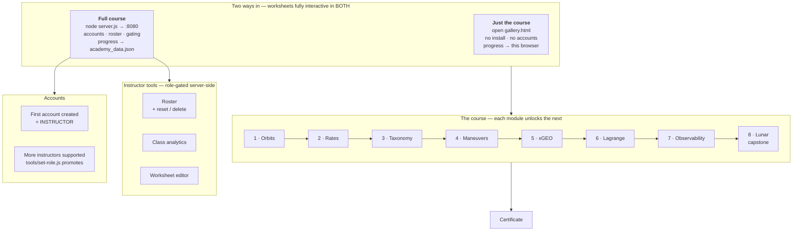

# 🛰 ORBIT ACADEMY — v5.2

An interactive course teaching orbital dynamics to non-specialists — from "what is an orbit?" through
cislunar space. Eight modules, each a guided worksheet plus a live 3-D simulator.

**Runs completely offline. Nothing to install, build, or download — not even the 3-D library.**

---

# Install

## 1 · Pick a version

| | **Just the course** | **Full course + management** |
|---|---|---|
| | worksheets + simulators | adds accounts & tracking |
| **Install** | **nothing** | Node.js (free, 1 installer) |
| **Progress saved** | in your browser | per student, any machine |
| **You get** | all 8 modules, interactive quizzes | + logins, modules unlocking in order, instructor roster, class analytics, worksheet editor |
| **Use it for** | learning solo · reviewing · a laptop in a vault | teaching a group |
| **Download** | `orbit-academy-v5.2-standalone.zip` | `orbit-academy-v5.2.zip` |

No download handy? Click green **`<> Code` → Download ZIP** above; that is the full version.

## 2 · Install it

**Everyone: unzip it, then open `START-HERE.html`.** Done — that page has a button for each version.

If you want the exact clicks:

### 🍎 macOS

```
1. Double-click the .zip in Downloads.
2. Drag the "academy" folder to your home folder.
3. Just the course:  open academy/public/gallery.html
   Full course:      install Node.js from nodejs.org (take "LTS"),
                     then double-click academy/start-academy.command
                     → first time only: right-click it → Open → Open
                     → leave the window open, go to http://localhost:8080
```

### 🪟 Windows

```
1. Right-click the .zip → Properties → tick "Unblock" → OK.   ← do this FIRST
2. Right-click → Extract All → Extract.
3. Move the "academy" folder to C:\Users\<you>\academy
4. Just the course:  open academy\public\gallery.html
   Full course:      install Node.js from nodejs.org (take "LTS"),
                     then double-click academy\start-academy.bat
                     → if SmartScreen warns: More info → Run anyway
                     → leave the window open, go to http://localhost:8080
```

### 🐧 Linux

```
1. unzip orbit-academy-v5.2.zip && cd academy
2. Just the course:  xdg-open public/gallery.html
   Full course:      install node with your package manager, then
                     bash start-academy.sh
                     → go to http://localhost:8080
```

## 3 · If you are teaching

**Register your own account first — the first account created becomes the instructor.** A brand-new
server tells you so on its sign-in screen. No default password ships with the course.

Then see the [Instructor FAQ](public/faq.html) for rosters, deleting students, and seeing which
questions the class got wrong.

---

<details>
<summary><b>Troubleshooting — the four things that actually go wrong</b></summary>

| What you see | Fix |
|---|---|
| Nothing works right after extracting (Windows) | You skipped **Unblock**. Delete the folder, unblock the `.zip`, extract again. This is the most common problem by far. |
| "unidentified developer" (macOS) | Normal for downloaded scripts. Right-click the launcher → **Open** → **Open**. |
| A page saying **"No course server is running"** | You opened `index.html`, which needs the server. Use the `gallery.html` link on that page, or start the launcher. |
| A simulator is blank / "3-D library not loaded" | A file did not survive the unzip — **never** an internet problem, since the library ships inside. Extract again. |

Also: use Chrome, Edge or Firefox (Safari is strict about pages opened from disk), and in the
no-install version Module 8's window shows plain shaded planets instead of mapped ones — browsers
block reading pixels from local image files. It says so on screen; no number or physics result changes.

</details>

<details>
<summary><b>How the pieces fit together</b> (diagram)</summary>



</details>

<details>
<summary><b>Requirements, and what is deliberately NOT required</b></summary>

| Need | Notes | Required for |
|---|---|---|
| A browser with WebGL | Chrome, Edge, Firefox, Safari — last ~3 years | Everything; the simulators are 3-D |
| three.js r128 | **already in the repo** at `public/vendor/` | The 8 simulators |
| Node.js LTS (18+) | one ~50 MB installer; uses **only** Node built-ins | *Only* the full/tracked version |

**Not required:** no npm packages · no bundler · no database · no Docker · no internet at any point ·
no admin rights except installing Node · no build step.

Windows, macOS and Linux behave identically — `server.js` is plain Node with no OS-specific code.

</details>

<details>
<summary><b>Air-gapped install, and verifying a copy is intact</b></summary>

No special procedure: copy the folder to the isolated machine and follow the steps above. Nothing is
fetched at install time or run time.

**Every byte the course needs is committed to this repository**, including the 3-D library and planet
maps — so there is no version drift; every classroom runs identical bytes, today and in five years.
Provenance, licenses and SHA-384s: [`public/vendor/NOTICE.md`](public/vendor/NOTICE.md).

```bash
bash tools/fetch-vendor.sh --check     # every vendored asset matches its recorded hash
node test/no-external-calls.test.js    # nothing in the course can call out
```

Expected: `PASS — every vendored asset matches public/vendor/NOTICE.md.`

</details>

<details>
<summary><b>Sharper Earth and Moon (optional NASA upgrade)</b></summary>

The maps that ship with the course come from the three.js examples: Earth 2048&times;1024, Moon
1024&times;512 — for the whole body. Module 8 flies within a few hundred kilometres of the surface,
which magnifies them hard. One command, once, with network:

```bash
bash tools/fetch-hires.sh           # both bodies, recommended sizes
bash tools/fetch-hires.sh moon      # Moon only  (LRO/LROC mosaic, 4096x2048)
bash tools/fetch-hires.sh earth     # Earth only (Blue Marble NG, 5400x2700)
bash tools/fetch-hires.sh --big     # largest practical sizes
bash tools/fetch-hires.sh --revert  # undo
```

Sources, both public domain: NASA SVS [CGI Moon Kit](https://svs.gsfc.nasa.gov/4720) (LROC Wide Angle
Camera mosaic) and NASA [Blue Marble Next Generation](https://visibleearth.nasa.gov/collection/1484/blue-marble)
(MODIS/Terra). Please credit NASA. Each map has several candidate URLs and the script reports which
worked — NASA reorganises its sites, and if all fail it prints the page to visit and exactly where to
drop the file by hand. The files are gitignored (large, converted locally) but **are** carried into any
bundle you build, so one person fetches and everyone downstream gets the sharp maps. Provenance:
[`public/vendor/NOTICE.md`](public/vendor/NOTICE.md).

</details>

<details>
<summary><b>Releasing a new version (maintainers)</b></summary>

One command does the whole thing — test, build, commit, push, publish:

```bash
bash tools/release.sh "what changed in this version"
```

In order, it: clears a stale `.git/index.lock`; refuses to proceed if `academy_data.json` is tracked
or un-ignored; runs **every** suite plus the Module 8 cockpit flights and **stops before touching git
if anything fails**; checks README/CHANGELOG/SECURITY actually mention this version; builds both zips;
verifies each one unpacks and that the full one *boots and serves the course*; then commits, pushes,
and (with the [GitHub CLI](https://cli.github.com)) creates the release with both zips attached so the
download links above resolve.

```bash
bash tools/release.sh --dry-run                 # everything except commit/push/publish
bash tools/release.sh --no-release "msg"        # commit and push, skip the GitHub release
BUNDLE_DIR=/tmp bash tools/release.sh --dry-run # write the zips somewhere else
```

Just the zips, without releasing:

```bash
bash tools/make-bundle.sh              # full edition        (~11 MB)
bash tools/make-bundle.sh --vanilla    # standalone edition  (~9.6 MB)
bash tools/make-bundle.sh --full       # full + tests and build tools (developers)
```

Both are built from this one tree, so they cannot drift. The build refuses to ship if
`academy_data.json` leaks in, a required asset is missing, or any CDN reference survives, and prints a
SHA-256 to publish alongside the file.

*Why a zip and not a `.pkg`/`.msi`?* The course has one dependency (Node.js) and only for the tracked
version. An **unsigned** native installer warns more loudly than a zip, signing needs a paid Apple
Developer ID or Windows code-signing certificate, and in accredited or air-gapped facilities
installers frequently cannot run at all (admin rights, application allowlisting) — whereas an unpacked
folder passes review easily.

</details>

---

<details>
<summary><b>Running a class — accounts, roles, rosters, analytics</b></summary>

**Accounts and roles**

- **The first account registered on a server becomes the instructor**; everyone after is a student.
  A brand-new server says so explicitly on its sign-in screen and switches straight to
  "Create the instructor account", so the role cannot be claimed by accident.
- **More than one instructor is supported** — nothing caps the count, and it is covered by
  `test/multi-instructor.test.js`.
- **Promote or demote from the command line**, with the server stopped:

  ```bash
  node tools/set-role.js                              # list accounts, ★ marks instructors
  node tools/set-role.js you@example.org instructor    # promote
  ```

  There is deliberately **no API** that grants the instructor role: an endpoint handing out
  instructor rights is the most valuable privilege-escalation target this backend could expose.
  Role changes are an offline, file-level operation, which grants nothing to anyone who could not
  already read the data file. Equally, **no default account or password ships with the course** —
  a fixed credential in the repo would be identical on every installation worldwide and would live
  in git history permanently.

  > `set-role.js` re-reads the file after writing, because a running server holds the whole database
  > in memory and rewrites it on every save — silently undoing edits made underneath it. Stop the
  > server first; the tool tells you plainly if it was reverted.

**Managing students** — on the Roster tab, each row has **reset** (clear progress, keep the login) and
**delete** (remove the account and invalidate its sessions). Delete asks you to type `DELETE`. The
server refuses to let you delete your own account or the last remaining instructor.

**Seeing where the class struggled** — the **📊** tab ranks the tasks the cohort got wrong most often
and shows a per-student grid of modules with wrong-answer counts. This matters because *every* student
eventually answers correctly — a wrong answer just asks again — so "passed" alone tells you little;
the wrong-answer count is the teaching signal.

**Back up `academy_data.json`.** That one file is your class records: accounts, salted password hashes
and every completion. It is gitignored for that reason, and deletion from the dashboard cannot be
undone without it.

</details>

<details>
<summary><b>For reviewers — the 60-second version</b></summary>

Everything runs on your own computer (nothing is exposed on the public internet), and it works
identically on **Windows, macOS, and Linux**.

> **Full step-by-step instructions are above: [🍎 macOS](#-macos--step-by-step) ·
> [🪟 Windows](#-windows--step-by-step).** The short version follows.

**Step 1 — get the files onto your computer.** No tools or GitHub knowledge needed:

1. In a web browser, go to **https://github.com/JASONSS26/orbit-academy** (sign in to GitHub if it
   asks — this is a private project, so use the account that was invited to it).
2. Find the green button labeled **`<> Code`** near the top-right of the file listing and click
   it. In the menu that drops down, click **Download ZIP**. A file called
   `orbit-academy-main.zip` lands in your Downloads folder.
3. Unzip it: on **Windows**, right-click the file → **Extract All…** → Extract; on **macOS**,
   just double-click it. Either way you get a folder — open it and you'll find an **`academy`**
   folder inside. That's the whole course. (You can move it anywhere you like, e.g. the Desktop.)

*(If you use git: `git clone https://github.com/JASONSS26/orbit-academy.git` does the same thing.)*

*(There is no step 1b. The 3-D library and planet maps are already inside the folder you just
downloaded — nothing to fetch, nothing to install. If you want to prove the copy is intact, run
`bash tools/fetch-vendor.sh --check`.)*

**Step 2 — run it.** Two options:

- **Zero-install (no Node, nothing to set up):** in the folder you just downloaded, open
  `academy/public/gallery.html` by double-clicking it — it opens in your browser, with a link to
  every worksheet and simulator. Progress saves in that browser. (A couple of features degrade
  without the server; see below.)
- **Full experience (accounts, roster) — needs Node.js:** the server is a JavaScript program, so
  the computer needs [Node.js](https://nodejs.org) — a one-time ~50 MB install (grab the **LTS**
  installer, click through it; no packages, no build step, nothing else to install, ever). Then
  in the `academy` folder, double-click **`start-academy.bat`** (Windows) or
  **`start-academy.command`** (macOS — first time: right-click → Open → Open); it checks for
  Node, starts the server, and opens your browser — keep its window open. (Terminal users:
  `cd orbit-academy/academy && node server.js`.) Then browse to
  **http://localhost:8080/gallery.html** for the no-login gallery, or the main hub at
  **http://localhost:8080/** to create an account — the first account registered becomes the
  instructor.

**If something doesn't start:** `'node' is not recognized` → open a *new* terminal window after
installing Node. "Port 8080 already in use" → the Academy is probably already running; just open
http://localhost:8080. Full install walkthrough: `docs/INSTRUCTOR_GUIDE.md` §2–3.

</details>

## The eight modules

Orbits → angular rates & geosync → orbit taxonomy & TLEs → maneuvers → xGEO/cislunar →
Lagrange points → observability → **lunar transfer capstone** (a flyable cockpit).
Each is a worksheet plus a 3-D simulator; each unlocks the next.

<details>
<summary><b>What each module covers, in detail</b></summary>

- **Module 1 — How Orbits Work** (complete): circular/elliptical orbits, speed-vs-altitude,
  prograde/retrograde, geosynchronous vs. geostationary, inclination, launch geography.
- **Module 2 — Angular Rates & Geosync** (complete): split-view (top-down + ground telescope),
  the GEO belt & slots, geostationary vs. geosynchronous, sky-from-the-ground streaks & frames.
- **Module 3 — Naming Orbits & TLEs** (complete): the six Keplerian elements (live-slider
  ellipse), "TLE of your orbit," and real orbits incl. Molniya/Tundra and a **sun-synchronous
  preset** with a live Sun marker and true **J2 nodal precession** (the node–Sun readout locks at
  98.2° — the orbit that tells time).
- **Module 4 — Maneuvers & Perturbations** (complete): Δv burns (with a fuel "gas gauge"),
  GTO→GEO transfer, drag decay & re-entry, escape/unbound orbits, radiation pressure/HAMR,
  J2 & sun-synchronous — a 3-D simulator with real RK4 integration of gravity + drag.
- **Module 5 — xGEO / Cislunar Space & Reference Frames** (complete): the Earth–Moon–Sun system,
  four reference frames (ECI / synodic / MCI / **ECL-EMBR**, the barycentric-rotating "Lagrange
  frame") with a 2×2 compare view, Hill spheres & Lagrange points, the true-position barycenter,
  xGEO defined, and "lead-the-Moon" lunar transfers.
- **Module 6 — Lagrange Points & Complex Orbits** (complete): the five Lagrange points
  (▲ markers + 1-D force balance + a toggleable **gravity landscape**, the co-rotating
  effective-potential surface), near-rectilinear halo orbits (NRHO, à la CAPSTONE/Gateway),
  TESS's 2:1 resonance, and **six live RK4 fan-release experiments** on the true restricted
  three-body field: lunar-scatter slingshots (one object flung past Earth's Hill sphere), the
  **L1 knife-edge** (≤8 m/s decides moonward vs earthward), stable **L4 tadpoles**,
  **DRO vs prograde** lunar parking (the Artemis I story), the Apollo **free-return figure-8**
  (4 of 7 eventually make it home — only the true free-returns on Apollo's schedule), and
  **temporary minimoons** captured and released by lunar flybys (à la 2006 RH120 / 2020 CD3),
  with green **capture halos**, a to-scale dashed **Hill-sphere ring**, and auto-zoom.
- **Module 7 — Observability** (complete): how we actually find & track objects — **radar**
  (range⁴ law, gain-vs-integration, pulse SNR ∝ √N), **optical** reflected-sunlight phases &
  light curves, **RA/DEC** on a 3-D celestial sphere, a **tag-&-fit initial-orbit-determination**
  tool, parallax, and the orbitology → characterization → intent ladder.
- **Module 8 — Lunar Transfers & Artemis** (the capstone flight sim): plan the transfer in a
  flight computer, then **fly it** from an Artemis-class cockpit — **two missions flown in
  order**: GEO servicing, then (unlocked by a successful GEO run) the **lunar graduation flight**,
  a genuine **three-burn** profile (TLI → lead the Moon → retrograde LOI brake → cued
  circularization in lunar orbit) — with a real RK4 three-body model, thrust in the **local
  flight frame** (Earth-relative, Moon-relative inside its sphere of influence), burn
  **countdowns** and **live guidance** recomputed from the current orbit, an **🤖 AUTO FLY**
  autopilot that flies the same controls as the pilot, ILS-style instruments + approach gates,
  a Δv budget/logbook, a true 3-D out-the-window view (physically-lit 3-D target satellite),
  a **TRAIN** free-flight sandbox, and a scored debrief.
- The **live simulators** (`tut1.html`–`tut8.html`) with matching camera/time controls.
- **Interactive worksheets** (shared engine): each opens beside its simulator with learning
  **objectives**, a one-page **tutorial** (analogy + diagram), and **numbered exercises** built on a
  **predict → act → analyze** loop — teaching prose, a "predict first" prompt, hands-on steps that
  invite iteration, things to look for, reflection questions, then a check question — ending with a
  **final quiz**, **key-points summary**, and **resources**. Progress saves to the server, or — with
  no server — to the browser (**standalone mode**, so the static files run anywhere).
- A printable **controls cheat sheet** (`cheatsheet.html`) and a **resources index** by module
  (`resources.html`), linked from every worksheet and the hub.
- **Backend** (`server.js`, optional): accounts, login/sessions, per-task progress, prerequisite
  gating, instructor dashboard. Zero dependencies.

All eight modules are complete. **Note on course order:** Observability is **Module 7** and the
flight-sim capstone is **Module 8** (file ids `tut7`/`worksheet7` = Observability, `tut8`/`worksheet8`
= flight sim). **Instructors:** see `docs/INSTRUCTOR_GUIDE.md` for
download, install, hosting options, and teaching notes. (Note: standard GitHub Pages is
world-readable even for a private repo — for authorized-only access, have reviewers clone & run
locally, as above.)

</details>

<details>
<summary><b>Architecture</b></summary>

- **Fat client, thin server.** All physics/rendering/UI runs in the browser (Three.js from CDN,
  SRI-pinned). The server only does static files + auth + progress + prerequisites (~250 lines,
  zero dependencies).
- **Data store:** `academy_data.json` — holds password hashes (scrypt) and progress.
  **Gitignored; never committed.**

</details>

<details>
<summary><b>File map</b></summary>

- `server.js` — backend (auth, progress, gating, roster)
- `public/index.html` — the Academy hub (login, flight-path map, instructor dashboard)
- `public/worksheetN.html` + `worksheetN.data.js` — each module's worksheet (shell + content)
- `public/worksheet-engine.js` / `.css` — the shared worksheet engine used by all modules
- `public/tutN.html` — the module simulators
- `public/cheatsheet.html` — printable controls wallet card
- `public/resources.html` — external-resources index, by module
- `public/quiz.js` — tutorial registry
- `docs/` — `INSTRUCTOR_GUIDE.md`, `SECURITY.md` (audit log), `CHANGELOG.md`, `TESTING.md`, `MODULE_NOTES.md`

### New in v5.2

```
public/textures.js              planet-texture resolution (local → CDN if allowed → schematic)
public/vendor/                  ALL committed: three.min.js + 4 planet maps + NOTICE.md (hashes)
public/gallery.html             the no-server entry point (start here without Node)
public/faq.html                 instructor FAQ (accounts, classes, troubleshooting)
START-HERE.html                 landing page: pick no-install learning or the tracked classroom
start-academy.command/.bat/.sh  double-click launchers for macOS / Windows / Linux
tools/set-role.js               list / promote / demote accounts (server stopped)
tools/make-bundle.sh            build the distributable zips; --vanilla for the learner edition
tools/fetch-vendor.sh           --check verifies every asset hash; repair-download; --cdn opt-out
tools/make-textures.py          regenerates the schematic Earth/Moon maps (numpy + PIL)
test/no-external-calls.test.js  proves zero outbound calls (static scan + runtime monitor)
test/tut8-cockpit.verify.js     headless cockpit: flies both Module 8 missions to completion
```

</details>

<details>
<summary><b>Tests</b></summary>

```bash
bash test/run.sh   # 34 functional + 48 security + DoS + air-gap + vendor + run-modes + multi-instructor
```
See `docs/TESTING.md`. Zero dependencies; run before every release.

```bash
bash test/run.sh                        # functional 34 + security 48 + DoS + air-gap + vendor
                                        # + both run modes + file:// + multi-instructor
node test/no-external-calls.test.js     # air-gap check on its own (no server needed)
node test/tut8-cockpit.verify.js        # flies both Module 8 missions headlessly (17 checks)
bash tools/fetch-vendor.sh --check      # what is vendored; whether anything can call out
```

</details>

## Security

Each release passes a security audit (see `docs/SECURITY.md`). v1.0–v5.2: **PASS** — path traversal
contained, auth enforced, no privilege escalation, prerequisite gating server-side, input
validated, DoS-guarded, no XSS, no secrets committed. From **v5.0** the client is also verified to
make **no outbound network calls** (`test/no-external-calls.test.js`, static + runtime), and the
optional Module 1 "paste your API key" tutor has been removed so no field can carry a credential
off-box. All modules and the v2.x worksheet engine are
static client-side files (no new server surface). For internet-facing use, front it with HTTPS +
rate-limiting (see SECURITY.md "Accepted").

## License

MIT.
